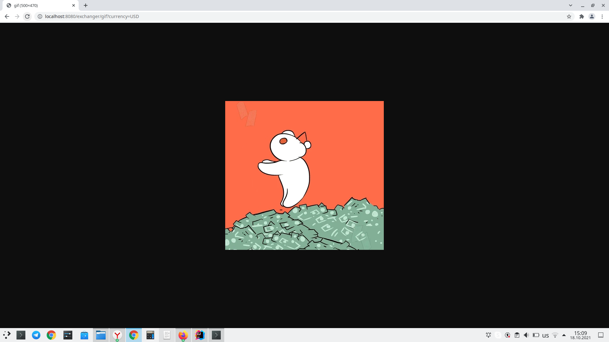

Задание размещено в фале Task.md

Подключил Travis CI - служба непрерывной интеграции

1. Описание Приложение согласно задаче принимает 2 показателя курс валюты на вчерашний день и курс валюты на сегодняшний
   день далее идет сравнение. после чего производиться выдача результата в формате Gif на адрес
   пример http://localhost:8080/exchanger/gif?currency=USD
   по умолчанию доллар USD так как в бесплатной версии доступен только он.
2. Запуск
клонируем проект git clone https://github.com/evgenkolesman/ExchangerGif
проверяем что мы находимся в папке если что используем команду cd для смены местоположения
запуск через Gradle: gradle run или другими способами надо запустить наш main метод.
3. Получим что то такое в нашем браузере:

Докер пока не готов
